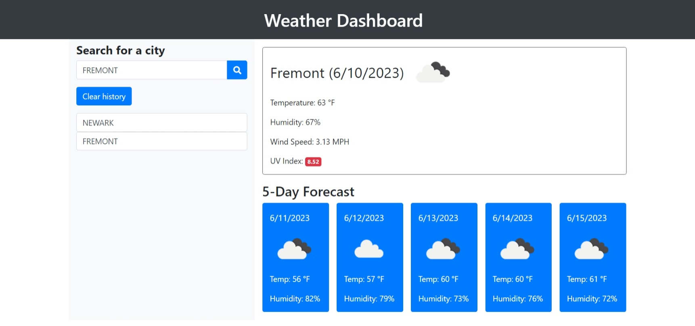
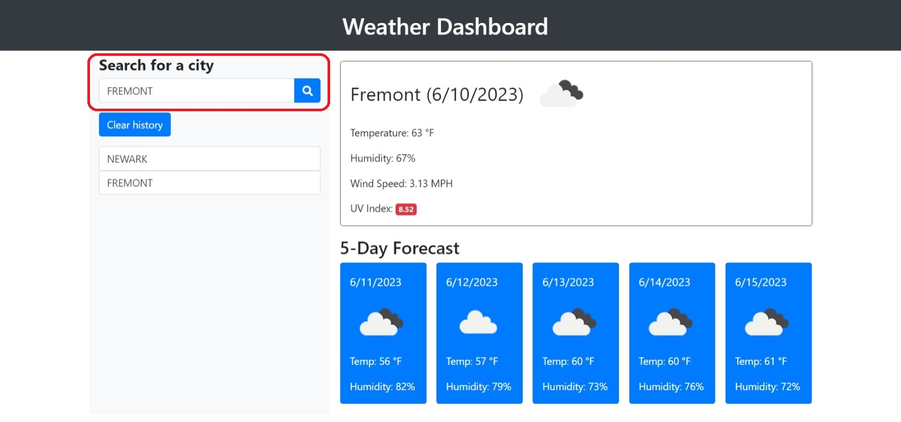
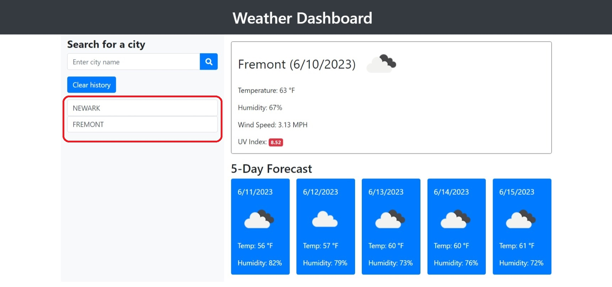

# Challenge 06 - Weather Dashboard

##  Description

The weather dashboard allows the end user to look up the weather conditions for any city around the world. It presents them with the current and future conditions for the city they search for. Additionally, it keeps track of which cities they have searched for so they can search for the weather conditions again with the click of a button. 

My goal from the start was to use Bootstrap to style the app. This gave me plenty of exposure to the framework and I feel more comfortable using it than I did previously. It also gave me the opportunity to implement modals and learn how to use them more in depth.

The weather data is coming from the [OpenWeather API](https://openweathermap.org/api). Retrieving the data wasn't difficult, but understanding how the JSON data was structured was a bigger effort than I expected which led to having to rewrite my JavaScript code a few times.

## Table of Contents
- [User Story](#user-story)
- [Acceptance Criteria](#acceptance-criteria)
- [Links](#links)
- [Screenshots](#screenshots)

## User Story

```
AS A traveler
I WANT to see the weather outlook for multiple cities
SO THAT I can plan a trip accordingly
```

## Acceptance Criteria

```
GIVEN a weather dashboard with form inputs
WHEN I search for a city
THEN I am presented with current and future conditions for that city and that city is added to the search history
WHEN I view current weather conditions for that city
THEN I am presented with the city name, the date, an icon representation of weather conditions, the temperature, the humidity, and the wind speed
WHEN I view future weather conditions for that city
THEN I am presented with a 5-day forecast that displays the date, an icon representation of weather conditions, the temperature, the wind speed, and the humidity
WHEN I click on a city in the search history
THEN I am again presented with current and future conditions for that city
```
 
## Screenshots

### Dashboard


### Search


### History


## Links
[Link to Github Repository](https://github.com/VASUK-09/Weather-API-06.git)

[Link to Github pages](https://vasuk-09.github.io/Weather-API-06/)